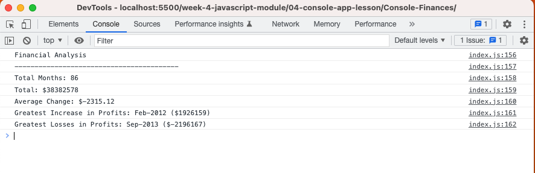
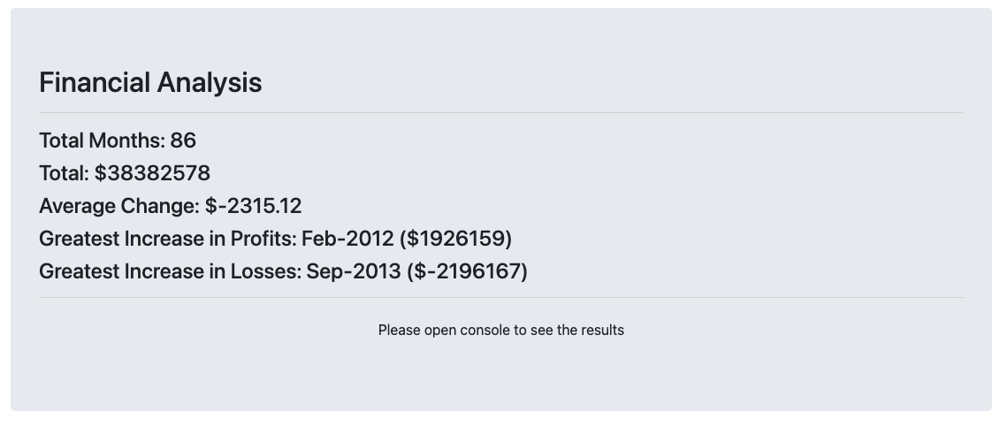

# Console Finances

## Description

The aim of this task was to use the JavaScript skills I whave picked up and put them into a real world scanerio. I was given some financial dataset of a company and my task was to display the data in a meaningful way displaying the total number of months, total amount earned as well as averages and greates profits/losses.

I first had to work out how to calculate how to get the desired results and then using for loops and conditional statements in JavaScript, I made the same calculations and displayed it within the console.

## Mockup

The image below shows the end result of my findings within the console.

## Review

This task not only tested my JavaScript abilities, but also was a great way to problem solve to get desired results. I used google to do some research and found wasy to do a similar task which I applied within this task. I also found a way to display the data within the browser page and applied what I had learned using bootstap to style the data.

The image below shows the end result of my findings within the browser.

## Deployment

[Financial Analysis Website - https://wmohammad83.github.io/Console-Finances](https://wmohammad83.github.io/Console-Finances)

## Resources Used

[Markdown Badges](https://github.com/Ileriayo/markdown-badges)

